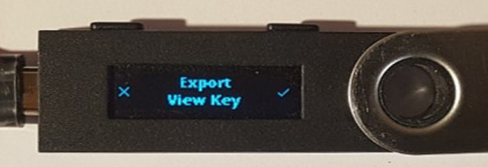
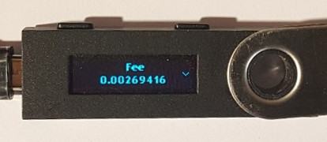
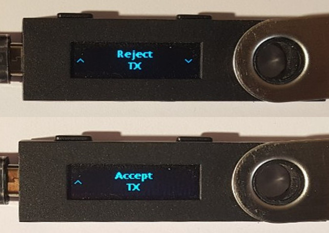
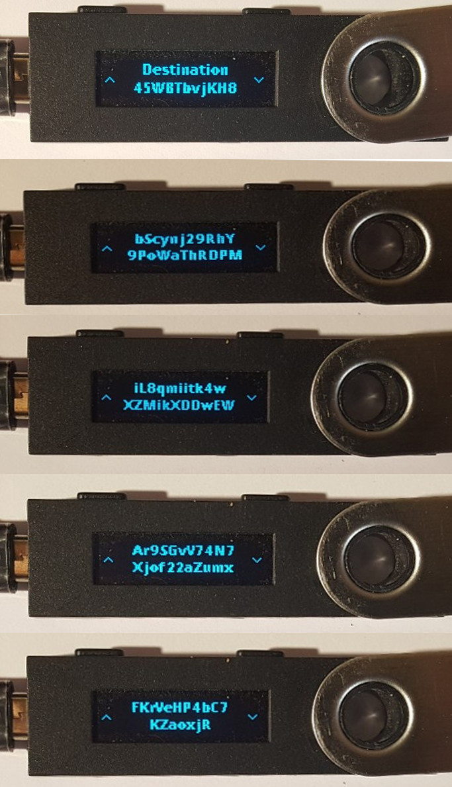

..
   Copyright 2018 Cedric Mesnil <cslashm@gmail.com>, Ledger SAS
   Licensed under the Apache License, Version 2.0 (the "License");
   you may not use this file except in compliance with the License.
   You may obtain a copy of the License at
   http://www.apache.org/licenses/LICENSE-2.0 
   Unless required by applicable law or agreed to in writing, software
   distributed under the License is distributed on an "AS IS" BASIS,
   WITHOUT WARRANTIES OR CONDITIONS OF ANY KIND, either express or implied.
   See the License for the specific language governing permissions and
   limitations under the License.

..
   ------------------------------------------------------------------------
                         LaTex substitution Definition
   ------------------------------------------------------------------------

..
   ------------------------------------------------------------------------
                                     DOC
   ------------------------------------------------------------------------

License
=======

Author: Cedric Mesnil <cedric@ledger.fr>

License:

  | Copyright 2018 Cedric Mesnil <cedric@ledger.fr>, Ledger SAS
  |
  | Licensed under the Apache License, Version 2.0 (the "License");
  | you may not use this file except in compliance with the License.
  | You may obtain a copy of the License at
  |
  |   http://www.apache.org/licenses/LICENSE-2.0
  |
  | Unless required by applicable law or agreed to in writing, software
  | distributed under the License is distributed on an "AS IS" BASIS,
  | WITHOUT WARRANTIES OR CONDITIONS OF ANY KIND, either express or implied.
  | See the License for the specific language governing permissions and
  | limitations under the License.

Introduction
============

Monero application for Ledger Blue and Nano S

How to install Monero Application
==================================

Nano S / Blue
-------------

For both, source and binary installation, use the most recent tag.

From Binary
~~~~~~~~~~~~~

Use the "Ledger Manager" Chrome App. See https://www.ledgerwallet.com/apps/manager for details.

As the "Monero" application is still in beta stage the application is in developer section: click on "Show developers items" on the bottom right corner to see it.

   - Launch the Ledger Manager. See `Ledger Manager <https://www.ledgerwallet.com/apps/manager>`_  
     and  ` <https://ledger.groovehq.com/knowledge_base/topics/ledger-manager>`_ 
     for details about installing and using  the manager;
   - Connect your Nano S or your Blue, enter your PIN, and stay on the 
     dashboard;
   - Click on *show developer items* on the bottom right corner;
   - Click on the green bottom arrow icon near the Ledger *Monero* logo;
   - Confirm the installation when required on your device by pressing the 
     right button above the checkmark;
   - Quit the Ledger Manager

The application is ready to use!

From source
~~~~~~~~~~~~~

Building from sources requires the the Nano S SDK 1.4.1+ on firmware 1.4.1+. See https://github.com/LedgerHQ/nanos-secure-sdk

Refer to the SDK documentation for the compiling/loading...

System Configuration
--------------------

Linux
~~~~~

The following packages must be installed: pcsc-tools pcscd libpcsclite1:amd64 .

You have to have to add the NanoS to /etc/libccid_Info.plist

    In  <key>ifdVendorID</key>      add the entry  <string>0x2C97</string>
    In  <key>ifdProductID</key>     add the entry  <string>0x0001</string>
    In  <key>ifdFriendlyName</key>  add the entry  <string>Ledger Token</string>
  
These 3 entries must be added at the end of each list.

MAC
~~~

The SmartCard service must be installed. See https://smartcardservices.github.io/

1. First it is necessary to [disable SIP](https://developer.apple.com/library/mac/documentation/Security/Conceptual/System_Integrity_Protection_Guide/ConfiguringSystemIntegrityProtection/ConfiguringSystemIntegrityProtection.html) That doesn't allow the editing of files in /usr/.

2. You have to add the Nano S to /usr/libexec/SmartCardServices/drivers/ifd-ccid.bundle/Contents/Info.plist

       In  <key>ifdVendorID</key>      add the entry  <string>0x2C97</string>
       In  <key>ifdProductID</key>     add the entry  <string>0x0001</string>
       In  <key>ifdFriendlyName</key>  add the entry  <string>Ledger Token</string>
  
This 3 entries must be added at the end of each list.

3. [Enable SIP](https://developer.apple.com/library/content/documentation/Security/Conceptual/System_Integrity_Protection_Guide/ConfiguringSystemIntegrityProtection/ConfiguringSystemIntegrityProtection.html)

Windows
~~~~~~~

SmartCard service should be already installed. Maybe you have to start it.

Nano S Monero application explained
===================================

Menu Overview
-------------

The full menu layout is :

| \ *Device Info*
| Settings
|       Change Network
|             \ *It will reset the device*
|             Abort
|             Test Network
|             Stage Network
|             Main Network
|       Reset
| About 
|      \ *Monero*
|      \ *(c) Ledger SAS*
|      \ *Spec M.m*
|      \ *App M.m.µ*

| Emphasis entries are not selectable and just provide information. 
| A "**+**" after the entry label means current value.

Device Info
-------------

The *Device Info* provides current user and slot information. The format is:

|      <Monero: public key >

Settings
--------

Change Network
~~~~~~~~~~~~~~

Change the network pairing of the application. Some version maybe locked to Test or Stage network.

Reset
~~~~~

Selecting the menu will erase all Monero Application data and will 
reset the application in its '*just installed*' state.
 

Nano-S Monero Card application usage
=====================================

Monero
------

The Monero application is intended to be used with monero-wallet-cli 0.12.1+ on v7 network (March 2018 fork)
Previous network are not supported and will be not. Next network version will be added on time.

Today, the following feature are supported:

- Creating
- Restoring wallet
- Send Funds
- Receive Funds
- Sub-address

So the following commands are NOT supported:

- specific send:
    - submit_transfer 
    - transfer_original 
- import/export:
    - import_key_images 
    - export_key_images 
    - import_outputs 
    - export_outputs 
- multi-sig:
    - make_multisig 
    - prepare_multisig 
    - export_raw_multisig_tx 
    - sign_multisig 
    - finalize_multisig 
    - import_multisig_info 
    - export_multisig_info 
    - submit_multisig 
- proof generation
    - get_reserve_proof 
    - get_spend_proof 
    - get_tx_proof 
- misc
    - get_tx_key 
    - sign 
    - sign_transfer 
    - verify

Those command are planned to be added in future versions

Creating/Restoring Wallet
~~~~~~~~~~~~~~~~~~~~~~~~~

Creating or Restoring a wallet in done in the same manner as key comes from the Device. 

The basic command is ``monero-wallet-cli --generate-from-device </path/to/wallet/directory>``

When doing this you get warning message telling you are creating a new wallet. 

This means that the restore height will be set to the current network height and all all 
previous block will not be scanned for incoming transaction.

If you want to restore a wallet with already incoming transaction you have to restore 
from a specific provided height. Why do not simply restore from genesis?
Because Monero is a special network in which all transactions are
fully encrypted. That means the only way to know if a block contains a transaction for you is to decrypt
that transaction. Start from genesis will implies decrypting the whole blockchain on the device. 
Impossible: TOO LONG!

Finally there is last option that should be used: ``--subaddress-lookahead <Major:minor>``. By default 
when creating a wallet, the client pre-computes the first 200 addresses for the first 50 accounts
50:200. This setup take around 25 minutes. You can drastically reduce this time by using something like
`10:50`,

Finnally a suggested creation wallet command is :

    monero-wallet-cli --generate-from-device </path/to/wallet/file> --subaddress-lookahead 10:50

and creation wallet command is :

    monero-wallet-cli --generate-from-device </path/to/wallet/file> --restore-height <height> --subaddress-lookahead 10:50

**Note 1**: 

You device must be plugged with the Monero application launched BEFORE running the wallet. 
Once the wallet is running DO NOT quit the application nor unplug the device.

**Note 2**: 

Read the *Launching an existing wallet* about viewkey disclosure.

Launching an existing wallet
~~~~~~~~~~~~~~~~~~~~~~~~~~~~

Plug your device and launch the Monero application.

Launch your wallet as usual:

    monero-wallet-cli --wallet-file </path/to/wallet/file> 

On start, the device request you the authorization to export the private view key to the wallet client.
Accepting this request make the block scan for incoming transaction identification faster. In this mode
only your incoming transactions will be send to the device for decryption. If you do not accept ALL 
transaction, even those not for your wallet, will be sent to the device. 

In a short, accepting will disclose the secret viewkey to the client application but make the blockchain 
scan faster. Rejecting this disclosure is more confidential but also slower.

Sending Funds
~~~~~~~~~~~~~

Use *transfer* command normally and check your device to accept/reject fee, amount and destination.

Hereafter an example with some screenshots:

**Initial command**

    [wallet 4ARBwk]: transfer 45WBTbvjKH8bScynj29RhY9PoWaThRDPMiL8qmiitk4wXZMikXDDwEWAr9SGvV74N7Xjof22aZumxFKrVeHP4bC7KZaoxjR 1 BEE400001D122A00
    Wallet password: 

**NanoS Interaction**

After entering your password, the client prepare the transaction. Depending on your wallet and the number of destination
it may take a while.
Once the transaction is done, the device ask you to validate some information:

*Fee*

Check if your ok then scroll down and select either "Accept" or "Reject".

*Amount and destination*

Then for each destination you have to check amount

.. image:: amount.png
    :align: middle

and corresponding destination.

Again check if your ok, scroll down, and select either "Accept" or "Reject".

**Final client interaction**

Once fee and all destinations have been validated, the transaction is signed and a final agreement must be done on the 
client command line:

   | Transaction 1/1:
   | Spending from address index 0
   | Sending 1.000000000000.  The transaction fee is 0.002694160000
   | Is this okay?  (Y/Yes/N/No): y
   | Transaction successfully submitted, transaction <3c18ecf2e05e5c809d74dbbdc4b4255f45e30f62cbac96e1066d379c18e6b54e>
   | You can check its status by using the `show_transfers` command.
   | [wallet 4ARBwk]: 

Annexes
=======

References
----------

* [MONERO]        *Monero Project*, https://getmonero.org/
* [MONEROGIT]     *Monero Source Project*, https://github.com/monero-project/monero
